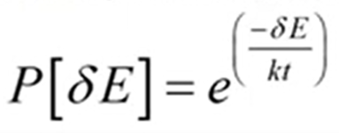

# Recocido_Simulado

## ¿Qúe es?

Es un algoritmo de busqueda por trayectoria.
Es una metametaheurística de optimización que trata mejorar la busqueda local que permite en algunas ocaciones viajar a hacia soluciones peores.

Recocido: tratamiento termico para agrandar materiales

- se eleve la temperatura alta
- se mantiene 
- se deja enfriar de manera lenta

- El parametro de temperatura contra la aceptacion
para que las soluciones vagen
- Cuando sean bajas intensifica la busqueda y
 ya no se permiten subir

 
 
- temperatura
- salto termico

## fundamentos
- Algoritmo estocastico, procesos aleatorios para
no llegar al mismo solucion

- Sin memoria para no regresar a soluciones anteriores

## Funcionamiento
- partimos de una solucion
- iteramos se genera un vecino (espacio de soluciones)
- si es MUCHO peor la probabilidad es baja
- si es POCO peor la probabilidad es alta
