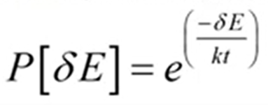

# Recocido Simulado

## ¿Qúe es?

Es un algoritmo de búsqueda por trayectoria. 
Es una metaheurística de optimización que trata mejorar la búsqueda local que permite en algunas ocasiones viajar a hacia soluciones peores.

Recocido: tratamiento térmico para agrandar materiales

- se eleve la temperatura alta
- se mantiene 
- se deja enfriar de manera lenta


- El parámetro de temperatura controla la aceptación 
- Una temperatura alta para que las soluciones sean mas aleatorias
- Cuando sean bajas intensifica la búsqueda y ya no se permiten subir


 
 
- (abajo) temperatura
- (arriba) salto térmico

## Fundamentos

- Algoritmo estocástico, procesos aleatorios para
no llegar a la misma solución

- Sin memoria para no regresar a soluciones anteriores


## Funcionamiento

- partimos de una solución
- iteramos, se genera un vecino (espacio de soluciones)
- si es MUCHO peor la probabilidad es baja
- si es POCO peor la probabilidad es alta

## Codigo

```{python}
import random
import math

#función que quiero optimizar
def funcion(x):
    return x**2

#valores inciales
temp_inicial = 100
tasa_enfriamiento = 0.9
solucion_actual = 10
iteraciones = 1000

#funcion recocido simulado
def recocido_simulado(temp_inicial, tasa_enfriamiento, solucion_actual, iteraciones):

    temperatura = temp_inicial
    solucion_mejor = solucion_actual
    mejores_soluciones = funcion(solucion_actual)
    i = 0

    # Se detiene cuando se enfria lo suficiente (NO muy alta, No muy baja)
    while temperatura > 0.1 and i < iteraciones:
        #Explorar diferenctes soluciones
        solucion_nueva = solucion_actual + random.uniform(-1, 1)
        #compara soluciones
        delta = funcion(solucion_nueva) - funcion(solucion_actual)
        #Delta es mejor
        if delta < 0:
            solucion_actual = solucion_nueva
            #Mejores soliciones
            if funcion(solucion_nueva) < mejores_soluciones:
                solucion_mejor = solucion_nueva
                mejores_soluciones = funcion(solucion_nueva)
        #Delta es peor
        else:
            #determinar si la nueva solución peor se acepta o no. 
            p = math.exp(-delta / temperatura)
            # Mucho Peor o poco peor
            if random.uniform(0, 1) < p:
                solucion_actual = solucion_nueva
        
        #reducimos la temperatura | sumamos i + 1 en cada iteracio             
        temperatura *= tasa_enfriamiento
        i += 1
    return solucion_mejor

#El resultado devuelto es la solución optimizada encontrada por el algoritmo.
resultado = recocido_simulado(temp_inicial, tasa_enfriamiento, solucion_actual, iteraciones)
print("Mejor solución optimizada:", resultado)
```